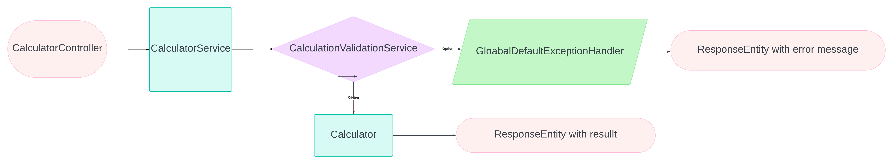
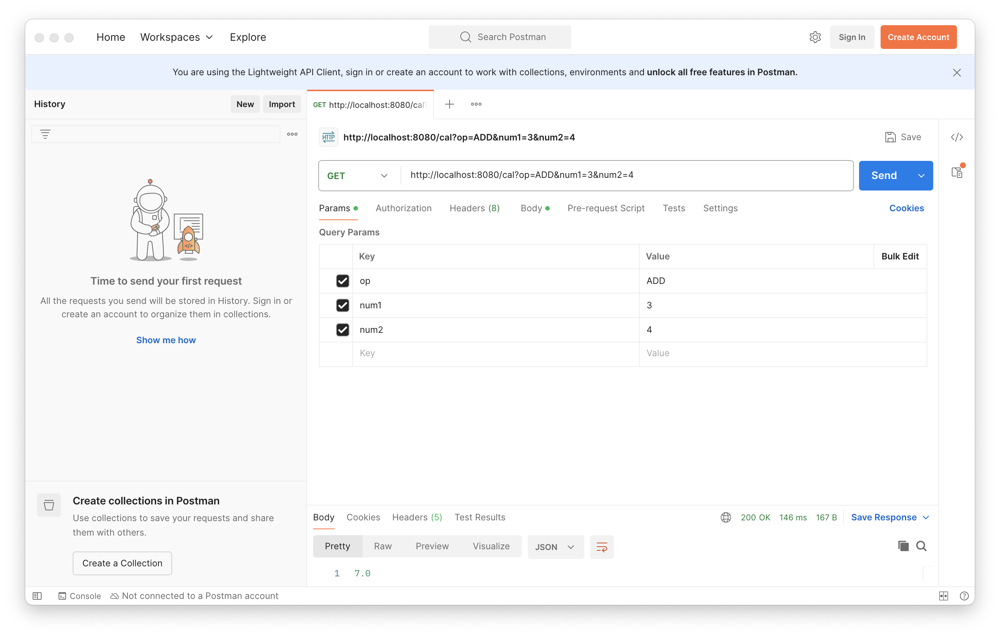
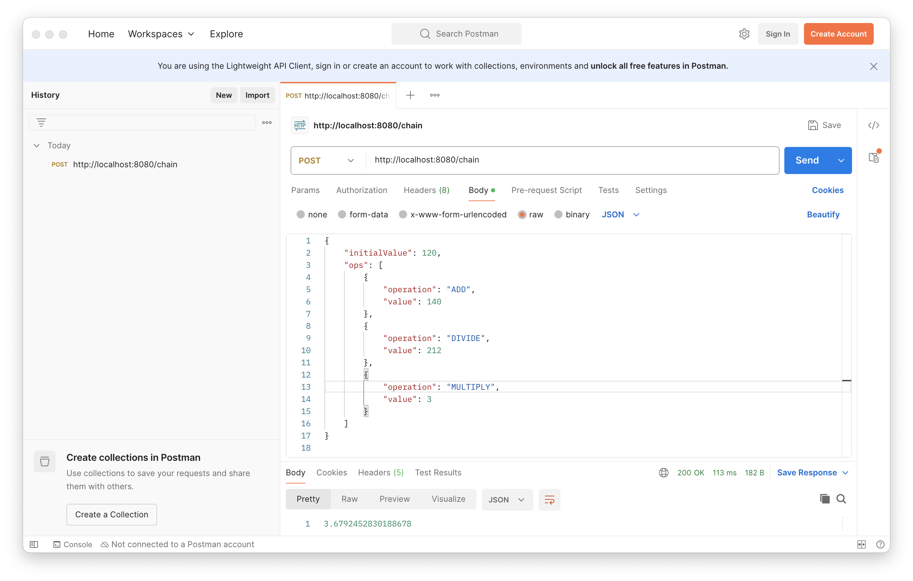
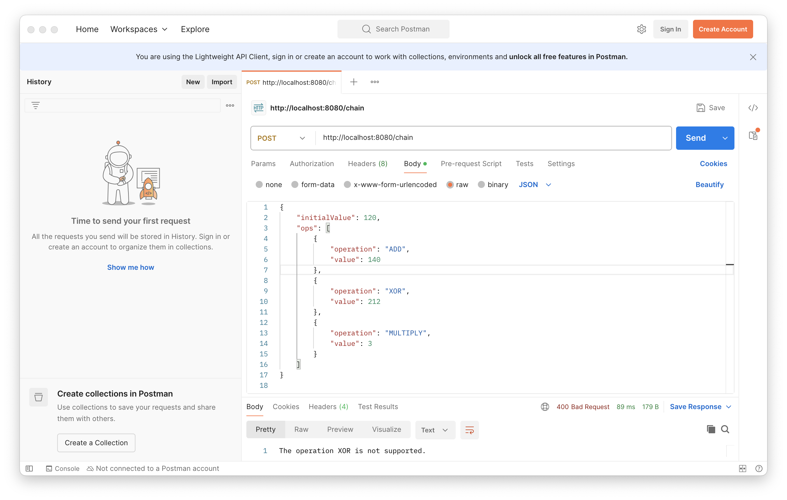

# A Flexiable Caclulator app

## Introduction


This is a calculator java project. It creates a simple, extensible calculator
in Java that adheres to the Open-Closed Principle (OCP), I design the system
with an interface for operations and separate classes for each operation.
This way, new operations can be added without modifying existing code.


## Project Overview
### Feature

* Support basic operations like ADD, SUBTRACT, MULTIPLY, and DIVIDE.
* Support for chaining multiple operations on a single value, similar to how basic calculators work.
* Allow new operations to be added without changes to the existing code.
* Handle invalid case with grace using custom Exception classes.

### Flowchart of the design




## Design Considerations
* Springboot framework is chosen to simplify development by reducing the need for extensive configuration.
* Implement the calculator operation with the Strategy Design Pattern, we will encapsulate different operations in separate classes, each implementing a common strategy interface.
* New operation can be easily extended by implements OperationStrategy interface and define the specific calculation behavior in the method cal().
* Define all valid operations in Enum Operation, other operations in the calculator will be rejected.
* Double is used as the basic data type, benefits are api request will auto-reject invalid number from UI. Double has a good precision, but in some cases, BigDecimal could have a better precision, but BigDecimal has some flows when dealing with divide operation.
* OperationAction class is defined, it includes one operation and one value, which is used in the chain calculation.
* Chain operation is written as a Chain request with a initial value and a list of OperationAction.
* Two types of calculations are supported by APIs. Basic calculation is get request, chain calculation is post request. Easy to test and easy to use.
* Unit tests are created using JUnit and Mockito.


## Alternatives Consideration
* BigDecimal is preferred in the finance area. In some cases, BigDecimal is crucial for financial calculations due to its ability to handle decimal numbers with precision. In future, it could leverage BigDecimal for business requirement.

## Build and run the project

1. Install openjdk-21 and Maven in your system
2. Clone the repo
   ```
   git clone git@github.com:yjtyjt/newRepo.git
   ```
3. Navigate to the project directory
   ```
   cd newRepo/Calculator
   ```
4. Build the project with maven
   ```
   mvn clean install
   ```
5. Start up the application with maven command or with IDE
   ```
   mvn spring-boot:run
   ```
6. Only run unit tests
   ```
   mvn test
   ```

## Postman API examples

### Basic calculation GET API


### Chain calculation POST API


### Unsupported calculation


